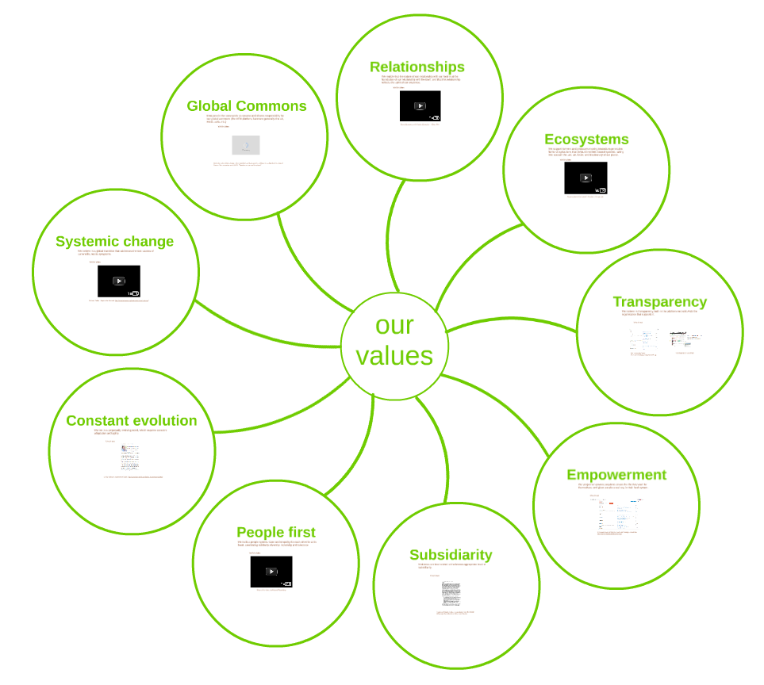

# Our values

We have collectively written a set of 9 values that drive our actions:  
- Global Commons  
- Relationships  
- Ecosystems  
- Transparency  
- Empowerment  
- Subsidiarity  
- People first  
- Constant evolution  
- Systemic change

You can discover and learn more about them [on the global OFN website](https://openfoodnetwork.org/about/values/) and through [that animation](https://prezi.com/tf6t5kkno790/view/#1).

