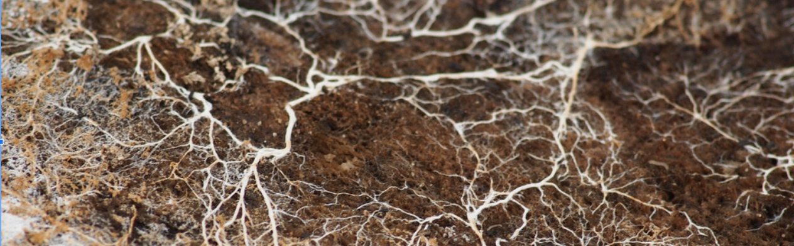

# Vision, mission, activities

## The solution proposed by the Open Food Network

If centralization and disconnexion are the two root causes that breaks our food system, then the solution is ... **to decentralize and reconnect !** 

### **Vision**

We carry on the vision of a decentralized food system, made up with thousands of independent and diverse distribution hubs reconnecting producers to customers. A transparent food system where the flow of the food from farm to fork is made open, so we know who came in between, what margin they took, what value they added. We believe distribution is key as by structuring the demand and creating markets for local organic food, food hubs secure the installation of new producers, and the transition of conventional farmers toward regenerative agriculture practices. Production and distribution needs to move hand in hand, but it's harder for farmers to change if they are not secured about if they will be able or not to sell their products... 

### Mission

In order to support the move toward that vision, the Open Food Network mission is to enable and support the development and sustainability of sovereign and independent food hubs reconnecting producers and consumers all over the world. 

### Activities

To do that, the OFN, through a global network of local communities and entities, provide tools, knowledge and support to food enterprises \(producers, hubs\) so that they can be more viable, resilient and efficient within the emergent value-driven food system. 

Concretely, that means:  
- we develop all together at a global scale the OFN software, share it open source, and local OFN communities deploy it and propose it through Saas services to their local ecosystem.  
- we develop all together knowledge about how food hubs work, we share it open source, and local OFN communities use it to facilitate learning communities of food hubs and provide consulting services to support them.

