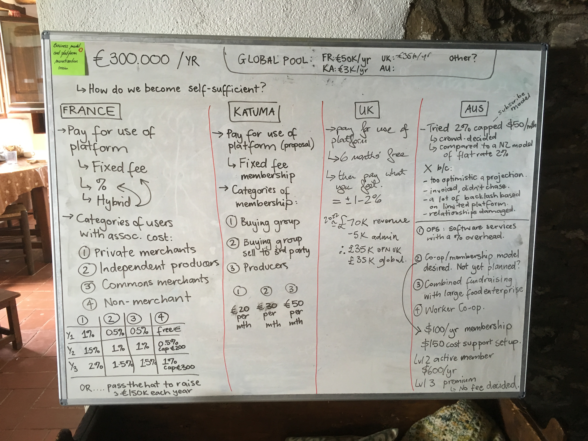

# Economic model

The economic model of the Open Food Network can be described at two different levels. Indeed, some resources are needed to develop the shared OFN software, and some resources are needed to provide support to users and pay for servers costs. Those don't happen at the same layer.

## The economic model of the global Open Food Network

### Our global costs

At the global level, there are people working in the global team on:  
- **product development**: developers, testers, UX designers, product owners doing feature specification, train drivers ensuring that developments move forward, curators that sort out the mess of all those priority things that we need to do... On this team, mainly the developers are paid until know and a bit the testers.  
- **global communication**: building and maintaining the global Open Food Network website. There is a work being done to separate the globale website from the Australian website, as the project was launched in Australia so info site is till use for both global and Australia for the moment. This role has been partially paid.  
- **community facilitation**: there are people active on welcoming and onboarding new contributors, answering people who want info about the OFN, supporting people who want to develop an OFN local entity where they live, etc. Those community facilitators are volunteers until now.  
- later on we will probably have more people working on **learning communities and global research** but for now we are doing that more locally.

**Our objective is to be able to pay the contributors who create value for the global commons, that benefit the whole OFN ecosystem**. We are not there yet, but that is our aim so we want to build a sustainable business model to achieve that.

On top of people wages, we also need to pay for some tools at the global level, like Toggl that we use for time tracking, or Matomo that we use for traffic analysis on all the local websites. We also cover some expenses linked to the global gatherings we organise once or twice a year since 2017.

Taking all that into account, we need probably around 400 k€ at a very minimum every year for our project to move forward at a reasonable pace. That means 300 k€ for the global product development team \(we counted 3 devs 3 days per week + for each day of dev, 1/3 day testing, 1/3 day UX and 2/3 days product owner and train drivers\) + 100 k€ for the other roles and costs altogether.

### Our global revenues

Revenues at global level only comes until now from local entities having found grants and fuel back money into developing the OFN software. Local instances need to build sustainable business models and not rely on grants, but **global level will always be financed by local entities contributing in financing the improvement of the shared global commons they use**.

What global level ask to local instances:  
  
**1. Demonstrable Commitment to the Commons**  
This might come in the form of the contributions of funds to the global fundraising effort. It might come in the form of significant contributions to the commons knowledge base include the code, documentation, facilitation and governance. We expect instances to:

* Participate in fundraising for OFN global by having a representative in the fundraising-circle
* Contribute 40% of their revenue or 40% of their time to global efforts, though this can fluctuate and can be commensurate to circumstance.

**2. Demonstrable Growth**

This is to demonstrate active local community and instance building efforts. If your user community and platform turnover are increasing this is a sign that your plans are working.

### Managing global budget and expenses

As we said, there is no "global entity" with a bank account. What's more, contributors are spread all over the world, so invoice in different currencies. So we are keeping track of our global budget and expenses today [on this spreadsheet](https://docs.google.com/spreadsheets/d/1EjDgQOGMAePgyvWv8gyIPgLPnvieWoWXO0bUzkz4pPA/edit?usp=sharing). We have local entities promising money to global budget, then actually affecting in their own local accounting that money to global pool. It's a "promise to pay until that level for the things to come". Every contributor and tools cost is taken in charge by a local entity, so they directly pay those invoices and capture what they have paid in that global spreadsheet. That way, we know real time what remains in our global wallet.

## The economic model of a local OFN affiliate

Local OFN entities, that we call affiliates, have also a **freedom over the business model** they implement on their territory. They are best places to know their ecosystem, and drive those conversations with their stakeholders.

So what we observe is that local affiliates **experiment different business models**, that we have summed up on this whiteboard image from our last global community gathering. Maybe it's not 100% clear, so feel free to ask if you have questions!

But the important point is that we are all conscious that we need to build local business models that enable each local affiliate to give back to global budget enough so that we collectively maintain and improve our global commons :-\) We are not yet there, but that's the plan!

The **main tasks done at affiliate levels** are:  
- servers and system administration cost  
- community building, reaching to hubs, gaining users  
- users' support  
- communication, content production, facilitating learning communities locally  
- coordination, networking, partnership  
- link with global team on product improvement by reporting users need, and participation to global governance of the commons

For now local affiliates are **still mainly funded by local charities**, like [Esmée Fairbairn Foundation](https://www.esmeefairbairn.org.uk/) in UK, [Foundation Daniel & Nina Carasso ](https://fondationcarasso.org/en)and [Fondation MACIF](https://www.fondation-macif.org/) in France, etc.

