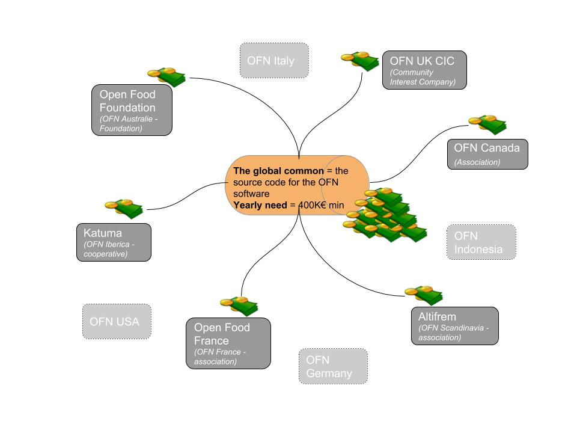

# Modelo Económico

El modelo económico de Open Food Network se puede describir en dos niveles diferentes. De hecho, se necesitan algunos recursos para desarrollar el software OFN compartido, y se necesitan algunos recursos para brindar soporte a los usuarios y pagar los costos de los servidores. Eso no sucede en el mismo nivel. 

## El modelo económico de la Open Food Network 

### Nuestros costos globales 

A nivel global, hay personas que trabajan en:

* **desarrollo de productos:** desarrolladores, evaluadores \(testers\), diseñadores de UX, propietarios de productos que realizan especificaciones de funciones, conductores de trenes que se aseguran de que los desarrollos avancen, curadores que ordenan las prioridades de lo que debemos hacer ... En este equipo, por ahora les pagamos principalmente a los desarrolladores y algo a los evaluadores \(testers\).
* **comunicación global:** construcción y mantenimiento del sitio web global de Open Food Network. Se está trabajando para separar el sitio web global del sitio web australiano, ya que el proyecto se lanzó en Australia, por lo que el sitio de información se está utilizando tanto para el mundo global como para Australia por el momento. Hemos pagado por esta tarea parcialmente.
* **Facilitación comunitaria:** hay personas activas en dar la bienvenida e incorporar nuevos colaboradores, responder a personas que quieren información sobre la OFN, apoyar a las personas que quieren desarrollar una entidad local OFN donde viven, etc. Esos facilitadores comunitarios son voluntarios hasta ahora.
* Más adelante probablemente tendremos más personas trabajando **en comunidades de aprendizaje e investigación global,** pero por ahora lo estamos haciendo de manera más local.

**Nuestro objetivo es poder pagar a los colaboradores que crean valor para los bienes comunes globales, que benefician a todo el ecosistema OFN**. Aún no estamos allí, pero ese es nuestro objetivo, por lo que queremos construir un modelo de negocio sostenible para lograrlo.

Además de los salarios de las personas, también debemos pagar por algunas herramientas a nivel mundial, como Toggl que usamos para el seguimiento del tiempo o Matomo que usamos para el análisis del tráfico en todos los sitios web locales. También cubrimos algunos gastos relacionados con los encuentros globales que organizamos una o dos veces al año desde 2017.

Teniendo todo eso en cuenta, probablemente necesitemos alrededor de 400K € como mínimo cada año para que nuestro proyecto avance a un ritmo razonable. Eso significa 300K € para el equipo de desarrollo de producto global \(contamos con 3 desarrolladores 3 días a la semana + por cada día de desarrollo, 1/3 de prueba, 1/3 de UX y 2/3 días de propietario de producto y conductores de tren\) + 100K € para las demás funciones y costos en conjunto.

### Nuestros ingresos globales

Los ingresos a nivel mundial hasta ahora solo provienen de entidades locales que han encontrado subvenciones \(grants\) y nos respaldan para desarrollar el software OFN. Las instancias locales necesitan construir modelos de negocios sostenibles y no depender de subvenciones, **pero el nivel global siempre será financiado por entidades locales que contribuyan a financiar la mejora de los bienes comunes globales compartidos que utilizan.** 

Idealmente, nuestro objetivo sería que las entidades OFN locales devuelvan al menos el 40% de sus ingresos para cofinanciar la mejora de la plataforma. Los costos de desarrollo son enormes en una empresa de tecnología y necesitamos un flujo de caja consecuente para mantener nuestros bienes comunes. Por ahora aún no hemos formalizado un porcentaje que toda instancia local debería destinar a la financiación de los bienes comunes globales, pero todos queremos que funcione.

### Gestionar el presupuesto y los gastos globales 

Como dijimos, no existe una "entidad global" con una cuenta bancaria. Además, los contribuyentes están repartidos por todo el mundo, por lo que facturan en diferentes monedas. Por lo tanto, estamos r haciendo un seguimiento de nuestro presupuesto y gastos globales hoy [en esta hoja de cálculo](https://docs.google.com/spreadsheets/d/1EjDgQOGMAePgyvWv8gyIPgLPnvieWoWXO0bUzkz4pPA/edit). Tenemos entidades locales que prometen dinero para el presupuesto global, y luego asignan en su propia contabilidad local ese dinero al fondo común. Es una "promesa de pagar hasta ese nivel por lo que vendrá". Cada colaborador y el costo de las herramientas lo asume alguna entidad local, y pagan directamente esas facturas y reportan lo que han pagado en esa hoja de cálculo global. De esa manera, sabemos en tiempo real lo que queda en nuestra billetera global.

## The economic model of a local OFN affiliate

Local OFN entities, that we call affiliates, have also a **freedom over the business model** they implement on their territory. They are best places to know their ecosystem, and drive those conversations with their stakeholders.

So what we observe is that local affiliates **experiment different business models**, that we have summed up on this whiteboard image from our last global community gathering. Maybe it's not 100% clear, so feel free to ask if you have questions!

But the important point is that we are all conscious that we need to build local business models that enable each local affiliate to give back to global budget enough so that we collectively maintain and improve our global commons :-\) We are not yet there, but that's the plan!

The **main tasks done at affiliate levels** are:  
- servers and system administration cost  
- community building, reaching to hubs, gaining users  
- users' support  
- communication, content production, facilitating learning communities locally  
- coordination, networking, partnership  
- link with global team on product improvement by reporting users need, and participation to global governance of the commons

For now local affiliates are **still mainly funded by local charities**, like [Esmée Fairbairn Foundation](https://www.esmeefairbairn.org.uk/) in UK, [Foundation Daniel & Nina Carasso ](https://fondationcarasso.org/en)and [Fondation MACIF](https://www.fondation-macif.org/) in France, etc.

