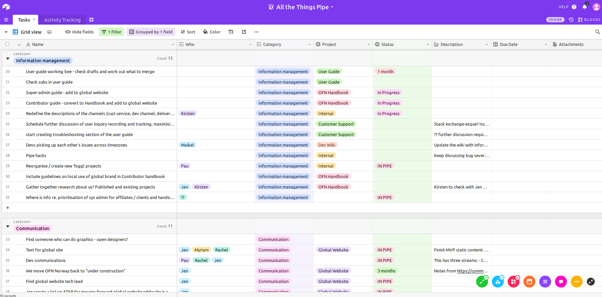
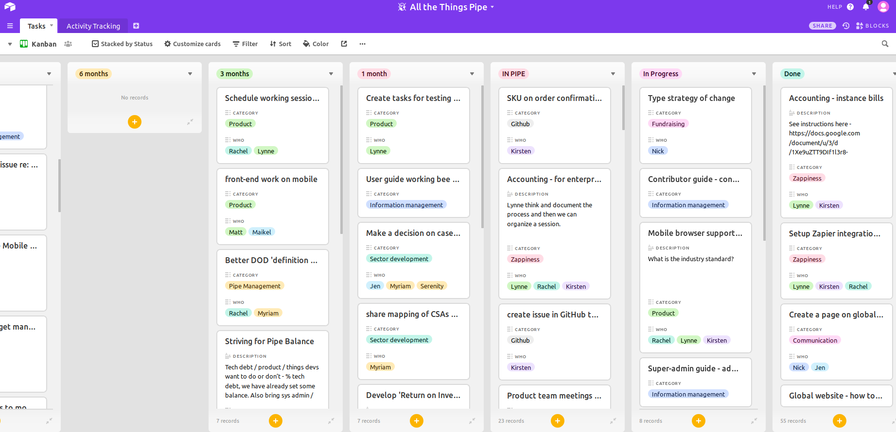

# How we prioritize general & sector development tasks

The OFN require a lot of day to day operations to make the project work, like facilitation, documentation, onboarding actions, communication, networking, etc.

Also, as explained before, we build not only technical open source resources \(the OFN software\) but also sector development resources. To do that we also have a team starting to getting better organized to collaborate, prioritize, document and share sector development resources.

Theses tasks require other skills than the dev skills required to develop a software of course :-\) But we all work together as the tools and knowledge are closely linked: when talking to users who think they need a tool to improve their efficiency, we sometime realize that their main issue might be somewhere else. So both work hand in hand.

The "all-the-things"' team is now structuring their work around a shared task pipe. A bit like the platform team use Github to list tasks, prioritize them, assign them and deliver. For that here we use the Airtable tool, which is a mix of a spreadsheet and Kanban view, with the ability to setup custom views. Here is [a read only acces of our "all-the-things" pipe on Airtable ](https://airtable.com/invite/l?inviteId=invZwOQIL261V8IAC&inviteToken=e366698a2dca4f324688d85b908e3ae18a3251276b3efd5132ec1e7465311300).

And here are screenshots of how it looks like:

### Priorization and review process

We plan to held a monthly session, as we have monthly delivery pipe session for the platform team, to go through the tasks, see if the things planned have been done, if not why, how to unlock, and decide to reprioritize if that's needed.

We are also going to organize coworking sessions on specific tasks whenever needed.

