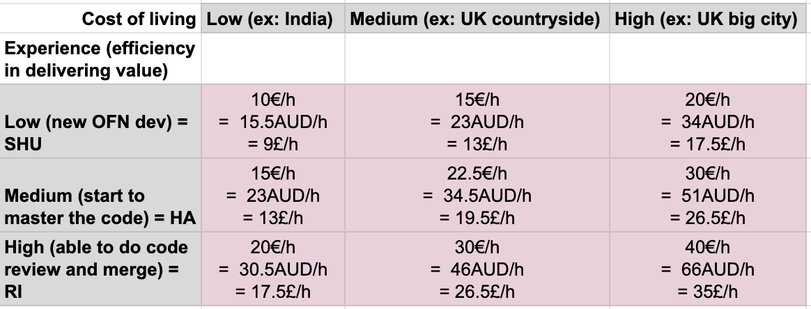

# Mastering levels and associated rates

As explained in the [onboarding process](onboarding-process.md) contributors need to be certified before they can be paid for their contributions.

The philosophy behind the value redistribution process is that the value generated by the OFN project should be distributed fairly to those who contributed to create the value. Inspired by the contributive/value accounting, our aim is to set up a retribution system that is not “equal” but “fair” and take into account:

* **the difference of value created by an OFN junior or senior contributor in one hour**

  For that we are inspired by the Japanese “ShuHaRi” experience level system. “Shu” is a beginner, “Ha” intermediate and “Ri” master. Those are levels in mastering an art. It seems fair that a “Shu” is not paid as much as a “Ri” as with the same time spent, a “Ri” will create more value for the project than a “Shu”.  
  In OFN, we consider that:  
  - a "Ri" contributor has over 3 years of experience in his domain and over 6 months in OFN  
  - a "Shu" meet none of those 2 criteria  
  - a "Ha" meets one of those 2 criteria

* **the cost of living of contributors**  
  It is not fair that a contributor who lives in a very expensive city is paid the same as a contributor working in a small countryside where rents are much cheaper for instance. Or contributors in India and Australia.

  I suggest on that point to use [**the cost of living index**](https://www.numbeo.com/cost-of-living/rankings_by_country.jsp). This is given by country, but it is also possible to [compare between cities](https://www.numbeo.com/cost-of-living/comparison.jsp). I suggest we stick to three cost of living categories to start with and iterate on the first cases. It might not always be easy to know for a contributor in which category they are.

So here is the table we came up with as a first iteration. We know the rates are not very high, but it's a start and it's already great that we collectively manage to get resources to pay some very engaged contributors! if you have any improvement suggestion, or if you feel you are in a specific situation that you want to discuss, please contact us.

\(Those rates are all tax inclusive, this is what should be invoiced per hour, no matter if it's a freelancer who invoices, or another legal entity.\)

